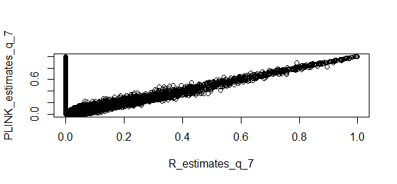
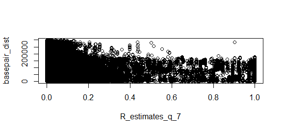
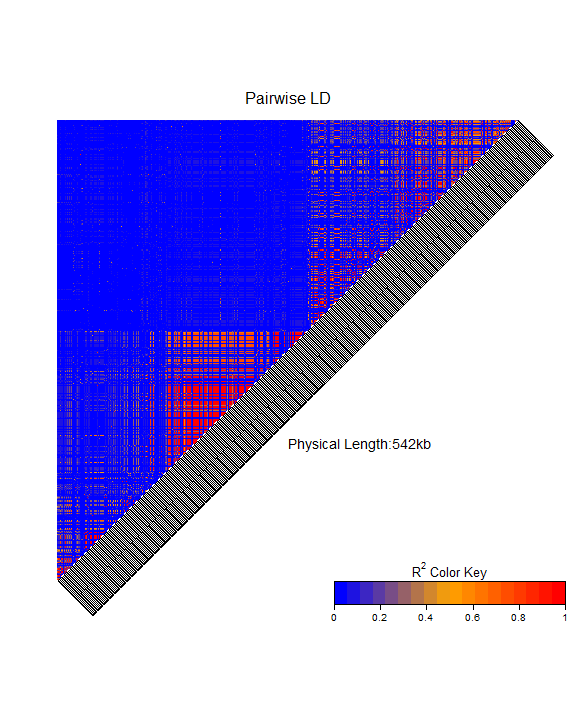
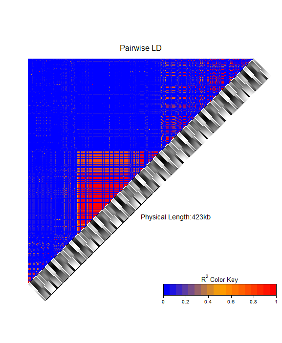
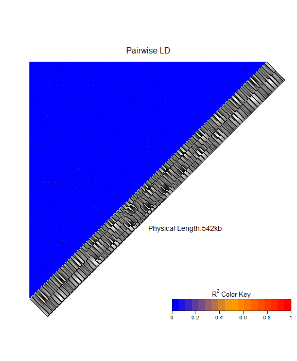

```{r, include=FALSE}
knitr::opts_chunk$set(echo = TRUE)
```

```{r, include=FALSE}
rm(list = ls(all.names = TRUE))
```


```{r load packages, include=FALSE, message=FALSE, warning=FALSE}
library(rstudioapi)
library(genetics)
library(HardyWeinberg)
library(LDheatmap)
library(haplo.stats)
library(stringr)
library(dplyr)
set.seed(2209)
current_path <- getActiveDocumentContext()$path 
setwd(dirname(current_path)) 
```

# Linkage Disequilibrium

files: https://www.cog-genomics.org/plink/1.9/formats#bim

## 2. Load the FOXP2.dat file into the R environment. How many individuals and how many SNPs are there in the database? What percentage of the data is missing?

```{r load_data_question_1_2, echo=FALSE}
genotypeData <- read.table("FOXP2/FOXP2.dat", header = TRUE)
genotypeData <- genotypeData[, 2: ncol(genotypeData)]
```

```{r question_2}
individuals <- nrow(genotypeData); individuals
SNPs <- ncol(genotypeData); SNPs 
perc.mis <- 100*sum(is.na(genotypeData))/(SNPs*individuals); perc.mis
```

We have 104 individuals and 543 SNPs (variants) in the dataset. No missing data.

## 3. Determine the genotype counts for each SNP, and depict all SNPs simultaeneously in a ternary plot, and comment on your result. For how many variants do you reject Hardy-Weinberg equilibrium using an ordinary chi-square test without continuity correction? (hint: you can read the .bim in R in order to determine the alleles of each SNP, and use function MakeCounts from the HardyWeinberg package to create a matrix of genotype counts). ‘

```{r load_data_question_1_3, echo=FALSE}
variantsColnames <- c("chromosome", "SNP id", "position", "basepair coordinate", "Allele 1", "Allele 2")
variantsData <- read.table("FOXP2/FOXP2.bim", header = FALSE, col.names = variantsColnames)
```

```{r question_3_1, out.width = "80%", fig.align="center"}
alleles.SNP <- paste(variantsData[,"Allele.1"], variantsData[,"Allele.2"], sep="/")
genotype.counts <- MakeCounts(genotypeData, alleles.SNP, sep="/")[,1:3]
HWTernaryPlot(genotype.counts)
```

It seems that the majority of the SNPs follow the HWE.

```{r question_3_2}
chisq.pvalues <- HWChisqStats(genotype.counts, pvalues = TRUE)
sum(chisq.pvalues < 0.05)
```

There are 33 SNPs whose p-values are below the 0.05 threshold. This means that, statistically, these variants follow the HWE.

## 4. Using the function LD from the genetics package, compute the LD statistic D for the SNPs rs34684677 and rs2894715 of the database. Is there significant association between the alleles of these two SNPs? 

```{r question_4}
rs34684677 <- genotypeData[, "rs34684677"]
rs2894715 <- genotypeData[, "rs2894715"]
rs34684677.g <- genotype(rs34684677,sep="/")
rs2894715.g <- genotype(rs2894715,sep="/")
LD(rs34684677.g,rs2894715.g)
```

We can notice that the estimated D is negative (-0.055), then we are on the repulsion case, this entails that probability of heterozygotes is higher than the expected under independence, the standarize D or D' has value near to 1 (0.999). As D' is close to 1 we can say that this variables have a high LD. Since p-value is below 0.05 we can reject the H0 that states that D=0 (D'=0 and cor=0) and confirm that estimated values for D, D' and correlation are valids.

## 5. Also compute the LD statistic D for the SNPs rs34684677 and rs998302 of the database. Is there significant association between these two SNPs? Is there any reason why rs998302 could have stronger or weaker correlation than rs2894715?

```{r question_5}
# rs34684677 and rs998302
rs34684677 <- genotypeData[,"rs34684677"]
rs998302 <- genotypeData[,"rs998302"]
rs34684677.g <- genotype(rs34684677, sep="/")
rs998302.g <- genotype(rs998302, sep="/")
LD(rs34684677.g,rs998302.g)
# rs2894715 and rs34684677
rs2894715 <- genotypeData[,"rs2894715"]
rs2894715.g <- genotype(rs2894715, sep="/")
LD(rs34684677.g,rs2894715.g)
```

In the case rs34684677 and rs998302,  p-value is > 0.05, therefore, we cannot reject the null hypothesis and we have to say that the D, D' and correlation estimates are not valid (not significantly different to 0).

In the case rs34684677 and rs2894715, p-value is << 0.5, meaning that we can reject the null hypothesis and take into account the estimated values of D, D' and correlation since they are significantly different to 0.

D´ is very close to 1, so there's a high LD.

## 6. Given your previous estimate of D for SNPs rs34684677 and rs2894715, infer the haplotype frequencies. Which haplotype is the most common?

```{r question_6}
snp1 <- unname(sapply(rs34684677, function (x) str_replace_all(x, "/", "")))
snp2 <- unname(sapply(rs2894715, function (x) str_replace_all(x, "/", "")))
Geno <- cbind(substr(snp1,1,1),substr(snp1,2,2),
              substr(snp2,1,1),substr(snp2,2,2))
snpnames <- c("rs34684677","rs2894715")
HaploEM <- haplo.em(Geno,locus.label=snpnames,control=haplo.em.control(min.posterior=1e-4))
HaploEM$hap.prob
```

From the EM algorithm output we can observe that the most commmon haplotype is GT, with probability 0.5.

## 7. Compute the LD statistics R2 for all the marker pairs in this data base, using the LD function of the packages genetics. Be prepared that this make take a few minutes. Also compute an alternative estimate of R2 obtained by using the PLINK program.

For this purpose you should:
* Download and install PLINK 1.90 from https://www.cog-genomics.org/plink2/
* Take care to store the files FOXP2.bim, FOXP2.fam and FOXP2.bed in a directory where PLINK can find them.
* Compute LD estimates with PLINK using plink --bfile FOXP2 --r2 --matrix --out FOXP2.ld. This creates a file with extension FOXP2.ld that contains a matrix with all R2 statistics. Read this file into the R environment. Make a scatter plot for R’s LD estimates against PLINK’s LD estimates. Are they identical or do they at least correlate? What’s the difference between these two estimators? Which estimator would your prefer and why?

```{r question_7_1, eval=FALSE}
R_estimates <- LD(makeGenotypes(genotypeData))
R_estimates <- R_estimates$`R^2`
plinkstring01 <- "plink --bfile FOXP2 --r2 --matrix --out FOXP2"
system(plinkstring01)
PLINK_estimates <- read.table("FOXP2.ld", header = TRUE)
write.table(R_estimates, file="R_estimates_q_7.Rdata")
write.table(PLINK_estimates, file="PLINK_estimates_q_7.Rdata")
```

```{r question_7_2, eval=FALSE}
R_estimates_q_7 <- read.table("R_estimates_q_7.Rdata")
PLINK_estimates_q_7 <- read.table("PLINK_estimates_q_7.Rdata")
R_estimates_q_7 <- R_estimates_q_7[2:dim(R_estimates_q_7)[1],]
R_estimates_q_7 <- as.vector(t(replace(R_estimates_q_7, is.na(R_estimates_q_7), 0)))
PLINK_estimates_q_7 <- as.vector(t(replace(PLINK_estimates_q_7, is.na(PLINK_estimates_q_7), 0)))
plot(R_estimates_q_7, PLINK_estimates_q_7)
```



The scatter plot of both estimates (R vs. PLINK) shows that there's a correlation between them. However, we have noticed that there are case where the PLINK estimate is 1 and the R estimate is 0, this is probably due to the fact that we have imputed the NAs as 0s, but still interesting because this means that in some cases R fails calculating the R2 and PLINK does not, so this later would be preferred.

## 8. Compute a distance matrix with the distance in base pairs between all possible pairs of SNPs, using the basepair position of each SNP given in the .bim file. Make a plot of R’s R2 statistics against the distance (expressed as the number of basepairs) between the markers. Comment on your results.

```{r question_8, eval=FALSE}
basepair_pos_df <- read.table("FOXP2.bim")
rownames(basepair_pos_df) <- basepair_pos_df$V2
basepair_pos_df <- basepair_pos_df %>% dplyr::select(V4)
basepair_dist_df <- as.matrix(dist(basepair_pos_df, method = "manhattan"))
diag(basepair_dist_df) <- NA # we have the elements of the diagonal in the matrix
basepair_dist <- as.vector(basepair_dist_df)
basepair_dist <- basepair_dist[!is.na(basepair_dist)]
plot(R_estimates_q_7, basepair_dist)
```



In the resulting plot we can observe that SNPs which are very distant from each other are generally not highly correlated, except in some very rare cases that could be considered outliers.

## 9. Make an LD heatmap of the markers in this database, using the R2 statistic with the LD function. Make another heatmap obtained by filtering out all variants with a MAF below 0.35, and redoing the computations to obtain the R2 statistics in R. Can you explain any differences observed between the two heatmaps?

```{r question_9, eval=FALSE}
rgb.palette <- colorRampPalette(rev(c("blue", "orange", "red")), space = "rgb")
LDheatmap(makeGenotypes(genotypeData), LDmeasure="r", color=rgb.palette(18)) # r stands for R2
maf_mask <- maf(genotype.counts) < 0.35
LDheatmap(makeGenotypes(genotypeData[,maf_mask]), LDmeasure="r", color=rgb.palette(18)) # r stands for R2
```

{#id .class width=50% height=50%}

{#id .class width=50% height=50%}

## 10. Can you distinguish blocks of correlated markers in the area of the FOXP2 gene? How many blocks do you think that at least seem to exist?

Observing the plots from question 9, it seems that there exist at least 2 blocks of correlated markers.

## 11. Simulate independent SNPs under the assumption of Hardy-Weinberg equilibrium, using R’s sample instruction [...]. Simulate as many SNPs as you have in your database, and take care to match each SNP in your database with a simulated SNP that has the same sample size and allele frequency. Make an LD heatmap of the simulated SNPs, using R2 as your statistic. Compare the results with the LD heatmap of the FOXP2 region. What do you observe? State your conclusions.

```{r question_11, eval=FALSE}
n <- dim(genotypeData)[1]
m <- dim(genotypeData)[2]
M <- matrix(0, n, m)
for (i in 1:m) {
  p <- unname(af(genotype.counts[i,]))
  q <- 1 - p
  M[,i] <- sample(c("AA","AB","BB"),n,replace=TRUE,prob=c(p*p,2*p*q,q*q))
}
M <- as.data.frame(M)
M <- M %>% mutate(across(everything(), function(x) genotype(x, sep="")))
rgb.palette <- colorRampPalette(rev(c("blue", "orange", "red")), space = "rgb")
LDheatmap(makeGenotypes(M), LDmeasure="r", color=rgb.palette(18))
```

{#id .class width=50% height=50%}

In the heatmap of the simulated SNPs under Hardy-Weinberg equilibrium, it is clearly observable that there are no identifiable correlation blocks of SNPs as in the case of the heatmap of the FOXP2 region's SNPs. This present correlation for some SNPs of the FOXP2 region suggests that the underlying cause is that there are not independent from each other.

# Haplotype estimation

## 1. Load data

```{r load_data_question_2_1}
haploData <- read.table("APOE/APOE.dat", header = TRUE)
haploData <- haploData[, 2: ncol(haploData)]
```

## 2. How many individuals and how many SNPs are there in the database? What percentage of the data is missing?

```{r question_2_2}
individuals <- nrow(haploData); individuals
SNPs <- ncol(haploData); SNPs 
perc.mis <- 100*sum(is.na(haploData))/(SNPs*individuals); perc.mis
```

We have 107 individuals and 162 SNPs (variants) in the dataset. No missing data.

## 3. Assuming all SNPs are bi-allelic, how many haplotypes can theoretically be found for this data set?

Assuming all SNPs are bi-allelic, there are 2^m possible haplotypes, so 2^152 being m the number of SNPs (5.8460065e+48).

## 4. Estimate haplotype frequencies using the haplo.stats package (set the minimum posterior probability to 0.001). How many haplotypes do you find? List the estimated probabilities in decreasing order. Which haplotype number is the most common?

```{r question_2_4}
snp_mat <- haploData %>%
            mutate(across(everything(),
              function(x) unname(sapply(x, function (x) str_replace_all(x, "/", "")))))
index <- 1
Geno <- cbind(substr(snp_mat[,index],1,1),substr(snp_mat[,index],2,2))
snpnames <- c(names(haploData)[index])
for (snp_i in 1:(SNPs - 1)) {
  index <- index + 1
  Geno <- cbind(Geno, substr(snp_mat[,index],1,1),substr(snp_mat[,index],2,2))
  snpnames <- c(snpnames, names(haploData)[index])
}
HaploEM <- haplo.em(Geno,locus.label=snpnames,control=haplo.em.control(min.posterior=1e-4))
sort(HaploEM$hap.prob, decreasing=TRUE)
which.max(HaploEM$hap.prob)
```

Haplotype number 27 of the 31 is the most common.

## 5. Is the haplotypic constitution of any of the individuals in the database ambiguous or uncertain? For how many? What is the most likely haplotypic constitution of individual NA20763? (identify the constitution by the corresponding haplotype numbers).

```{r question_2_5}

NA20763.ID <- which(individualData["IID"] == "NA20763")

```

## 6. Suppose we would delete polymorphism rs374311741 from the database prior to haplotype estimation. Would this affect the results obtained? Justify your answer.

```{r question_2_6, include=FALSE}
rs374311741 <- haploData[,"rs374311741"]

```

If we have a look to the variant rs374311741, we can realize that is an homozygote (only "C/C").
## 7. Remove all genetic variants that have a minor allele frequency below 0.10 from the database, and re-run haplo.em. How does this affect the number of haplotypes?

```{r question_2_7_1}

maf.list <- vector(mode="numeric", length=SNPs)

for (i in 1:SNPs) {
  variant.g <- genotype(haploData[, i],sep="/")
  variant.g.summary <- summary(variant.g)
  
  # MAF 
  maf.list[i] <- min(variant.g.summary$allele.freq[,"Proportion"], na.rm = T)

}

maf.ind <- which(maf.list < 0.1)

haploData.2 <- haploData[,-maf.ind]
```


```{r question_2_7_2}
SNPs.2 <- ncol(haploData.2);
snp_mat.2 <- haploData.2 %>%
            mutate(across(everything(),
              function(x) unname(sapply(x, function (x) str_replace_all(x, "/", "")))))
index <- 1
Geno.2 <- cbind(substr(snp_mat.2[,index],1,1),substr(snp_mat.2[,index],2,2))
snpnames.2 <- c(names(haploData.2)[index])
for (snp_i in 1:(SNPs.2 - 1)) {
  index <- index + 1
  Geno.2 <- cbind(Geno.2, substr(snp_mat.2[,index],1,1),substr(snp_mat.2[,index],2,2))
  snpnames.2 <- c(snpnames.2, names(haploData.2)[index])
}
HaploEM.2 <- haplo.em(Geno.2,locus.label=snpnames.2,control=haplo.em.control(min.posterior=1e-4))
sort(HaploEM.2$hap.prob, decreasing=TRUE)
which.max(HaploEM.2$hap.prob)
```

The number of haplotypes decrease significantly

## 8. We could consider the newly created haplotypes in our last run of haplo.em as the alleles of a new superlocus. Which is, under the assumption of Hardy-Weinberg equilibrium, the most likely genotype at this new locus? What is the probability of this genotype? Which genotype is the second most likely, and what is its probability?

```{r question_2_8, include=FALSE}


```